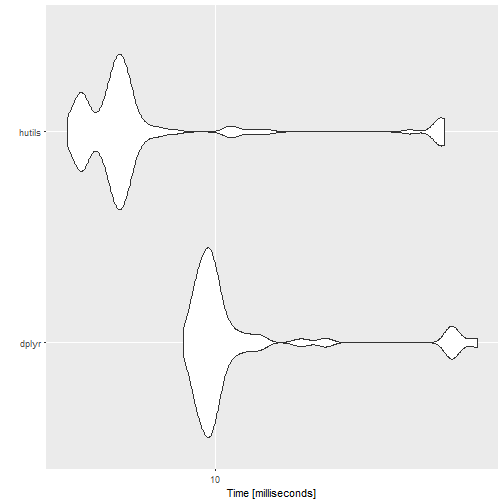
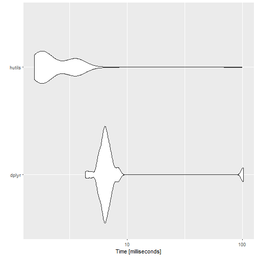
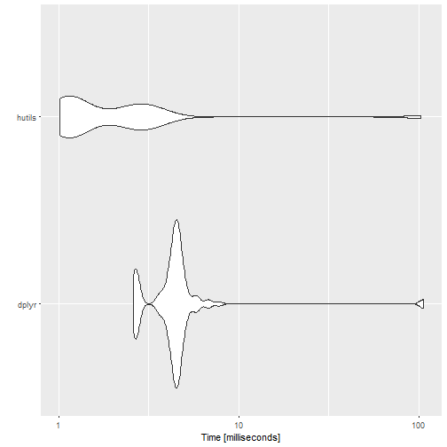
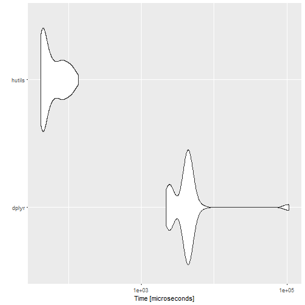
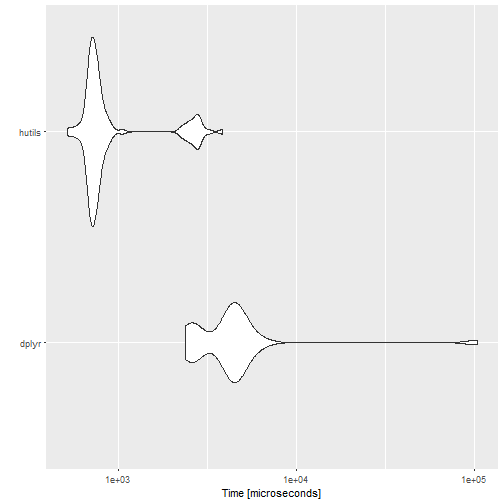

# `hutils` package
My name is Hugh. 
I've written some miscellaneous functions that don't seem to belong in a particular package.
I've usually put these in `R/utils.R` when I write a package.
Thus, `hutils`.

This vignette just goes through each exported function.


```r
library(knitr)
suggested_packages <- c("geosphere", "nycflights13", "dplyr", "ggplot2", "microbenchmark")
opts_chunk$set(eval = all(vapply(suggested_packages, requireNamespace, quietly = TRUE, FUN.VALUE = FALSE)))
```


```r
library(geosphere)
```

```
## Loading required package: sp
```

```
## Loading required package: methods
```

```r
library(nycflights13)
library(dplyr, warn.conflicts = FALSE)
library(ggplot2)
library(microbenchmark)
library(data.table, warn.conflicts = FALSE)
library(magrittr)
library(hutils, warn.conflicts = FALSE)
```

## Aliases

These are simple additions to `magrittr`'s aliases.
Two new features: capitalized forms of `and` and `or` that invoke `&&` and `||`, the 'long-form' logical operators, 
and `nor` / `neither` functions.

The main motivation is to make the source code easier to indent.
I occasionally such source code easier to use.


```r
OR(OR(TRUE,
      stop("Never happens")),  ## short-circuits
   AND(FALSE,
       stop("Never happens")))  
```

```
## [1] TRUE
```

`nor` (or `neither` which is identical) returns `TRUE` if and only if both arguments are `FALSE`.

## `coalesce` and `if_else`
These are near drop-in replacements for the equivalent functions from `dplyr`. 
They are included here because they are very useful outside of the tidyverse,
but may be required in circumstances where importing `dplyr` (with all of its dependencies) 
would be inappropriate.

They attempt to be drop-in replacements but:

  1. `hutils::if_else` only works with `logical`, `integer`, `double`, and `character` type vectors.
     Lists and factors won't work.
  2. `hutils::coalesce` short-circuits on its first argument; if there are no `NA`s in `x`, then `x` is returned, even
     if the other vectors are the wrong length or type.

In addition, `hutils::if_else` is generally faster than `dplyr::if_else`:


```r
my_check <- function(values) {
  all(vapply(values[-1], function(x) identical(values[[1]], x), logical(1)))
}


cnd <- sample(c(TRUE, FALSE, NA), size = 100e3, replace = TRUE)
yes <- sample(letters, size = 100e3, replace = TRUE)
no <- sample(letters, size = 100e3, replace = TRUE)
na <- sample(letters, size = 100e3, replace = TRUE)

microbenchmark(dplyr =  dplyr::if_else(cnd, yes, no, na),
               hutils = hutils::if_else(cnd, yes, no, na),
               check = my_check) %T>%
  print %>%
  autoplot
```

```
## Unit: milliseconds
##    expr      min       lq      mean   median        uq      max neval cld
##   dplyr 7.903185 9.026877 15.264821 9.736299 10.969167 69.93480   100   b
##  hutils 3.348184 4.307433  8.841032 4.871387  5.299059 54.42328   100  a
```



```r
cnd <- sample(c(TRUE, FALSE, NA), size = 100e3, replace = TRUE)
yes <- sample(letters, size = 1, replace = TRUE)
no <- sample(letters, size = 100e3, replace = TRUE)
na <- sample(letters, size = 1, replace = TRUE)

microbenchmark(dplyr =  dplyr::if_else(cnd, yes, no, na),
               hutils = hutils::if_else(cnd, yes, no, na),
               check = my_check) %T>%
  print %>%
  autoplot
```

```
## Unit: milliseconds
##    expr      min       lq      mean   median       uq       max neval cld
##   dplyr 4.350501 6.085883 11.184755 6.483738 7.000557 102.06255   100   b
##  hutils 1.570036 1.727100  3.429382 2.028277 3.467752  98.21291   100  a
```



This speed advantage also appears to be true of `coalesce`:


```r
x <- sample(c(letters, NA), size = 100e3, replace = TRUE)
A <- sample(c(letters, NA), size = 100e3, replace = TRUE)
B <- sample(c(letters, NA), size = 100e3, replace = TRUE)
C <- sample(c(letters, NA), size = 100e3, replace = TRUE)

microbenchmark(dplyr =  dplyr::coalesce(x, A, B, C),
               hutils = hutils::coalesce(x, A, B, C),
               check = my_check) %T>%
  print %>%
  autoplot
```

```
## Unit: milliseconds
##    expr      min       lq     mean   median       uq      max neval cld
##   dplyr 2.603976 3.966049 6.305486 4.444770 4.697458 106.9681   100   a
##  hutils 1.014666 1.136040 4.870917 1.296416 2.848833 102.5661   100   a
```



especially during short-circuits:


```r
x <- sample(c(letters), size = 100e3, replace = TRUE)

microbenchmark(dplyr =  dplyr::coalesce(x, A, B, C),
               hutils = hutils::coalesce(x, A, B, C),
               check = my_check) %T>%
  print %>%
  autoplot
```

```
## Unit: microseconds
##    expr      min       lq       mean   median       uq        max neval
##   dplyr 2201.604 2705.472 6939.64158 4281.532 4564.940 107767.144   100
##  hutils   41.261   43.671   63.29548   52.706   80.113    135.228   100
##  cld
##    b
##   a
```




```r
x <- sample(c(letters, NA), size = 100e3, replace = TRUE)
A <- sample(c(letters), size = 100e3, replace = TRUE)

microbenchmark(dplyr =  dplyr::coalesce(x, A, B, C),
               hutils = hutils::coalesce(x, A, B, C),
               check = my_check) %T>%
  print %>%
  autoplot
```

```
## Unit: microseconds
##    expr      min        lq     mean   median       uq        max neval cld
##   dplyr 2397.670 2744.9275 6977.021 4409.382 4627.886 104004.540   100   b
##  hutils  519.229  695.2675 1075.639  743.908  832.604   3832.176   100  a
```




## Drop columns
To drop a column from a `data.table`, you set it to `NULL`


```r
DT <- data.table(A = 1:5, B = 1:5, C = 1:5)
DT[, A := NULL]
```

There's nothing wrong with this, but I've found the following a useful alias, especially in a `magrittr` pipe.


```r
DT <- data.table(A = 1:5, B = 1:5, C = 1:5)
DT %>%
  drop_col("A") %>%
  drop_col("B")

# or
DT <- data.table(A = 1:5, B = 1:5, C = 1:5)
DT %>%
  drop_cols(c("A", "B"))
```

These functions simple invoke the canonical form, so won't be any faster.

Additionally, one can drop columns by a regular expression using `drop_colr`:


```r
flights <- as.data.table(flights)

flights %>%
  drop_colr("time") %>%
  drop_colr("arr(?!_delay)", perl = TRUE)
```

```
##         year month day dep_delay arr_delay flight tailnum origin dest
##      1: 2013     1   1         2        11   1545  N14228    EWR  IAH
##      2: 2013     1   1         4        20   1714  N24211    LGA  IAH
##      3: 2013     1   1         2        33   1141  N619AA    JFK  MIA
##      4: 2013     1   1        -1       -18    725  N804JB    JFK  BQN
##      5: 2013     1   1        -6       -25    461  N668DN    LGA  ATL
##     ---                                                              
## 336772: 2013     9  30        NA        NA   3393      NA    JFK  DCA
## 336773: 2013     9  30        NA        NA   3525      NA    LGA  SYR
## 336774: 2013     9  30        NA        NA   3461  N535MQ    LGA  BNA
## 336775: 2013     9  30        NA        NA   3572  N511MQ    LGA  CLE
## 336776: 2013     9  30        NA        NA   3531  N839MQ    LGA  RDU
##         distance hour minute
##      1:     1400    5     15
##      2:     1416    5     29
##      3:     1089    5     40
##      4:     1576    5     45
##      5:      762    6      0
##     ---                     
## 336772:      213   14     55
## 336773:      198   22      0
## 336774:      764   12     10
## 336775:      419   11     59
## 336776:      431    8     40
```

## `drop_empty_cols`
This function drops columns in which all the values are `NA`.
 

```r
planes %>% 
  as.data.table %>% 
  .[!complete.cases(.)]
```

```
##       tailnum year                    type                  manufacturer
##    1:  N10156 2004 Fixed wing multi engine                       EMBRAER
##    2:  N102UW 1998 Fixed wing multi engine              AIRBUS INDUSTRIE
##    3:  N103US 1999 Fixed wing multi engine              AIRBUS INDUSTRIE
##    4:  N104UW 1999 Fixed wing multi engine              AIRBUS INDUSTRIE
##    5:  N10575 2002 Fixed wing multi engine                       EMBRAER
##   ---                                                                   
## 3295:  N997AT 2002 Fixed wing multi engine                        BOEING
## 3296:  N997DL 1992 Fixed wing multi engine MCDONNELL DOUGLAS AIRCRAFT CO
## 3297:  N998AT 2002 Fixed wing multi engine                        BOEING
## 3298:  N998DL 1992 Fixed wing multi engine MCDONNELL DOUGLAS CORPORATION
## 3299:  N999DN 1992 Fixed wing multi engine MCDONNELL DOUGLAS CORPORATION
##           model engines seats speed    engine
##    1: EMB-145XR       2    55    NA Turbo-fan
##    2:  A320-214       2   182    NA Turbo-fan
##    3:  A320-214       2   182    NA Turbo-fan
##    4:  A320-214       2   182    NA Turbo-fan
##    5: EMB-145LR       2    55    NA Turbo-fan
##   ---                                        
## 3295:   717-200       2   100    NA Turbo-fan
## 3296:     MD-88       2   142    NA Turbo-fan
## 3297:   717-200       2   100    NA Turbo-fan
## 3298:     MD-88       2   142    NA Turbo-jet
## 3299:     MD-88       2   142    NA Turbo-jet
```

```r
planes %>% 
  as.data.table %>% 
  .[!complete.cases(.)] %>% 
  # drops speed
  drop_empty_cols
```

```
##       tailnum year                    type                  manufacturer
##    1:  N10156 2004 Fixed wing multi engine                       EMBRAER
##    2:  N102UW 1998 Fixed wing multi engine              AIRBUS INDUSTRIE
##    3:  N103US 1999 Fixed wing multi engine              AIRBUS INDUSTRIE
##    4:  N104UW 1999 Fixed wing multi engine              AIRBUS INDUSTRIE
##    5:  N10575 2002 Fixed wing multi engine                       EMBRAER
##   ---                                                                   
## 3295:  N997AT 2002 Fixed wing multi engine                        BOEING
## 3296:  N997DL 1992 Fixed wing multi engine MCDONNELL DOUGLAS AIRCRAFT CO
## 3297:  N998AT 2002 Fixed wing multi engine                        BOEING
## 3298:  N998DL 1992 Fixed wing multi engine MCDONNELL DOUGLAS CORPORATION
## 3299:  N999DN 1992 Fixed wing multi engine MCDONNELL DOUGLAS CORPORATION
##           model engines seats    engine
##    1: EMB-145XR       2    55 Turbo-fan
##    2:  A320-214       2   182 Turbo-fan
##    3:  A320-214       2   182 Turbo-fan
##    4:  A320-214       2   182 Turbo-fan
##    5: EMB-145LR       2    55 Turbo-fan
##   ---                                  
## 3295:   717-200       2   100 Turbo-fan
## 3296:     MD-88       2   142 Turbo-fan
## 3297:   717-200       2   100 Turbo-fan
## 3298:     MD-88       2   142 Turbo-jet
## 3299:     MD-88       2   142 Turbo-jet
```

## `duplicated_rows`
There are many useful functions for detecting duplicates in R.
However, in interactive use, I often want to not merely see which values are duplicated,
but also compare them to the original.
This is especially true when I am comparing duplicates across a *subset* of columns in a a `data.table`.


```r
flights %>%
  # only the 'second' of the duplicates is returned
  .[duplicated(., by = c("origin", "dest"))]  
```

```
##         year month day dep_time sched_dep_time dep_delay arr_time
##      1: 2013     1   1      600            600         0      837
##      2: 2013     1   1      607            607         0      858
##      3: 2013     1   1      608            600         8      807
##      4: 2013     1   1      623            627        -4      933
##      5: 2013     1   1      624            630        -6      840
##     ---                                                          
## 336548: 2013     9  30       NA           1455        NA       NA
## 336549: 2013     9  30       NA           2200        NA       NA
## 336550: 2013     9  30       NA           1210        NA       NA
## 336551: 2013     9  30       NA           1159        NA       NA
## 336552: 2013     9  30       NA            840        NA       NA
##         sched_arr_time arr_delay carrier flight tailnum origin dest
##      1:            825        12      MQ   4650  N542MQ    LGA  ATL
##      2:            915       -17      UA   1077  N53442    EWR  MIA
##      3:            735        32      MQ   3768  N9EAMQ    EWR  ORD
##      4:            932         1      UA    496  N459UA    LGA  IAH
##      5:            830        10      MQ   4599  N518MQ    LGA  MSP
##     ---                                                            
## 336548:           1634        NA      9E   3393      NA    JFK  DCA
## 336549:           2312        NA      9E   3525      NA    LGA  SYR
## 336550:           1330        NA      MQ   3461  N535MQ    LGA  BNA
## 336551:           1344        NA      MQ   3572  N511MQ    LGA  CLE
## 336552:           1020        NA      MQ   3531  N839MQ    LGA  RDU
##         air_time distance hour minute           time_hour
##      1:      134      762    6      0 2013-01-01 06:00:00
##      2:      157     1085    6      7 2013-01-01 06:00:00
##      3:      139      719    6      0 2013-01-01 06:00:00
##      4:      229     1416    6     27 2013-01-01 06:00:00
##      5:      166     1020    6     30 2013-01-01 06:00:00
##     ---                                                  
## 336548:       NA      213   14     55 2013-09-30 14:00:00
## 336549:       NA      198   22      0 2013-09-30 22:00:00
## 336550:       NA      764   12     10 2013-09-30 12:00:00
## 336551:       NA      419   11     59 2013-09-30 11:00:00
## 336552:       NA      431    8     40 2013-09-30 08:00:00
```

```r
flights %>%
  # Both rows are returned and (by default)
  # duplicates are presented adjacently
  duplicated_rows(by = c("origin", "dest"))
```

```
##         year month day dep_time sched_dep_time dep_delay arr_time
##      1: 2013     1   1     1315           1317        -2     1413
##      2: 2013     1   1     1655           1621        34     1804
##      3: 2013     1   1     2056           2004        52     2156
##      4: 2013     1   2     1332           1327         5     1419
##      5: 2013     1   2     1746           1621        85     1835
##     ---                                                          
## 336767: 2013     9  27     1516           1520        -4     1739
## 336768: 2013     9  29     1754           1755        -1     2019
## 336769: 2013     9  30      719            725        -6      916
## 336770: 2013     9  30     1519           1520        -1     1726
## 336771: 2013     9  30     1747           1755        -8     1941
##         sched_arr_time arr_delay carrier flight tailnum origin dest
##      1:           1423       -10      EV   4112  N13538    EWR  ALB
##      2:           1724        40      EV   3260  N19554    EWR  ALB
##      3:           2112        44      EV   4170  N12540    EWR  ALB
##      4:           1433       -14      EV   4316  N14153    EWR  ALB
##      5:           1724        71      EV   3260  N14153    EWR  ALB
##     ---                                                            
## 336767:           1740        -1      MQ   3532  N724MQ    LGA  XNA
## 336768:           2015         4      MQ   3713  N725MQ    LGA  XNA
## 336769:            945       -29      MQ   3547  N735MQ    LGA  XNA
## 336770:           1740       -14      MQ   3532  N725MQ    LGA  XNA
## 336771:           2015       -34      MQ   3713  N720MQ    LGA  XNA
##         air_time distance hour minute           time_hour
##      1:       33      143   13     17 2013-01-01 13:00:00
##      2:       36      143   16     21 2013-01-01 16:00:00
##      3:       31      143   20      4 2013-01-01 20:00:00
##      4:       33      143   13     27 2013-01-02 13:00:00
##      5:       31      143   16     21 2013-01-02 16:00:00
##     ---                                                  
## 336767:      160     1147   15     20 2013-09-27 15:00:00
## 336768:      160     1147   17     55 2013-09-29 17:00:00
## 336769:      150     1147    7     25 2013-09-30 07:00:00
## 336770:      148     1147   15     20 2013-09-30 15:00:00
## 336771:      146     1147   17     55 2013-09-30 17:00:00
```

## Haversine distance
To emphasize the miscellany of this package, I now present `haversine_distance`
which simply returns the distance between two points on the Earth,
given their latitutde and longitude.

I prefer this to other packages' implementations.
Although the `geosphere` package can do a lot more than calculate distances between points, I find the interface for `distHaversine` unfortunate as it cannot be easily used inside a `data.frame`. In addition, I've found the arguments clearer in `hutils::haversine_distance` rather than trying to remember whether to use `byrow` inside the `matrix` function while passing to `distHaversine`.


```r
DT1 <- data.table(lat_orig = runif(1e5, -80, 80),
                  lon_orig = runif(1e5, -179, 179),
                  lat_dest = runif(1e5, -80, 80),
                  lon_dest = runif(1e5, -179, 179))

DT2 <- copy(DT1)

microbenchmark(DT1[, distance := haversine_distance(lat_orig, lon_orig,
                                                    lat_dest, lon_dest)],
               
               DT2[, distance := distHaversine(cbind(lon_orig, lat_orig),
                                               cbind(lon_orig, lat_orig))])
```

```
## Unit: milliseconds
##                                                                                             expr
##           DT1[, `:=`(distance, haversine_distance(lat_orig, lon_orig, lat_dest,      lon_dest))]
##  DT2[, `:=`(distance, distHaversine(cbind(lon_orig, lat_orig),      cbind(lon_orig, lat_orig)))]
##       min       lq     mean   median       uq      max neval cld
##  18.80820 19.04237 21.15091 19.14853 19.28963 131.1547   100  a 
##  48.19133 54.36997 60.49637 55.63552 58.07294 165.4943   100   b
```

```r
rm(DT1, DT2)
```


## `mutate_other`

There may be occasions where a categorical variable in a `data.table` may need 
to modified to reduce the number of distinct categories For example, you may 
want to plot a chart with a set number of facets, or `randomForest` accepts
32 levels at most in a feature.

`mutate_other` keeps the *n* most common categories and change the 
other categories to `Other`.


```r
set.seed(1)
DT <- data.table(Fruit = sample(c("apple", "pear", "orange", "tomato", "eggplant"),
                                size = 20,
                                prob = c(0.45, 0.25, 0.15, 0.1, 0.05),
                                replace = TRUE),
                 Price = rpois(20, 10))

kable(mutate_other(DT, "Fruit", n = 3)[])
```


|Fruit | Price|
|:-----|-----:|
|apple |    14|
|apple |    11|
|pear  |     8|
|Other |     2|
|apple |     8|
|Other |    10|
|Other |     7|
|pear  |    12|
|pear  |    11|
|apple |    12|
|apple |    12|
|apple |    10|
|pear  |     3|
|apple |    11|
|Other |    13|
|pear  |     7|
|Other |     8|
|Other |    11|
|apple |    14|
|Other |     9|


